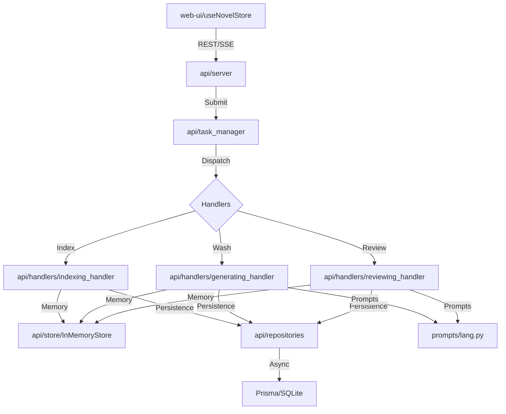

# Wash 系统说明书

---

## 目录

### 1. 技术栈与环境依赖 (Environment & Dependencies)

* 1.1 运行环境量化 (Python/Node/Docker)
* 1.2 环境变量协议 (LLM Config & System Behavior)
* 1.3 模型映射表 (Model Selection Strategy)

### 2. 底层架构与状态持久化 (Persistence & State)

* 2.1 Prisma 数据库模型深度解析 (Sessions, Tasks, Nodes)
* 2.2 InMemoryStore 内存管理 (RLock 并发锁, TTL 清理)
* 2.3 状态同步机制 (L1 Memory to L2 DB)

### 3. 数据预处理 Agent (Splitter & Indexer)

* 3.1 文本拆分 (Splitter) 正则引擎分析
* 3.2 并发索引 (Indexer) 资源调度模型
* 3.3 基因摘要 (Gene Index) 结构与验证标准

### 4. 协作规划 Agent (The Planner)

* 4.1 启发式 Planning Mode 自动检测算法
* 4.2 节点拓扑固化与后处理逻辑
* 4.3 故障降级与固化确认 (Confirmation)

### 5. 核心重构 Agent (Wash & Memory)

* 5.1 洗文重构 (Wash) 的两阶段执行流
* 5.2 递归状态传播与螺旋逻辑
* 5.3 全局记忆更新的递归合并算法

### 6. 任务编排与通讯链路 (Task Engine & SSE)

* 6.1 TaskManager 状态转移与断点恢复
* 6.2 实时消息总线 (EventBus) 的 SSE 协议细节
* 6.3 JSON 提取容错与 Markdown 清洗

### 7. 质量审计与生产力工具 (Editor & Review)

* 7.1 Reviewer Agent 的量化评分准则
* 7.2 自动修复 (Auto-Fix) 闭环流程
* 7.3 用户协同 AI (Copilot) 的上下文注入逻辑

### 8. 前端逻辑与应用交付 (Frontend & Deployment)

* 8.1 Zustand 步骤状态机持久化设计
* 8.2 提示词动态分发协议 (lang.py)
* 8.3 高并发 API 熔断与限流策略

### 9. 核心代码图谱与依赖拓扑 (Core Code Map)

* 9.1 系统组件依赖模型
* 9.2 唯一真理来源 (SSOT) 映射

### 10. 冗余代码识别与清洗指南 (Redundancy Analysis)

* 10.1 遗留逻辑清洗建议
* 10.2 性能死角与优化阈值

### 11. Agent 设计哲学与缓存策略 (Agent Design & Caching)

* 11.1 多 Agent 原子化编排模型
* 11.2 最大化命中缓存 (Client & Task Caching)

### 12. 进阶工作流与管控机制 (Workflow & Controls)

* 12.1 状态驱动的前端编排 (Frontend Orchestration)
* 12.2 提示词在线编辑 (Online Prompt Editing)
* 12.3 双语适配与动态探测机制 (Bilingual Support)

### 13. 部署、运维与观测 (Deployment, Ops & Monitoring)

* 13.1 容器化生命周期与健康自愈
* 13.2 启动清理与进程管控逻辑
* 13.3 UI 遥测与实时观测 (Observability)

### 14. 系统鲁棒性与异常处理 (Hardening & Fail-safe)

* 14.1 故障安全降级与线性兜底
* 14.2 结构化异常映射

---

### 1. 技术栈与环境依赖 (Environment & Dependencies)

#### 1.1 运行环境量化

系统采用容器化部署方案，核心运行环境如下：

* **后端运行时**: Python 3.11-slim。利用异步 IO (asyncio) 处理并发网络请求。
* **前端运行时**: Node.js 20-alpine。基于 Next.js 框架构建单页应用。
* **核心框架版本**:
  * Next.js: 16.1.1
  * React: 19.2.3
  * FastAPI: 基于异步 ASGI 规范，核心依赖 `sse-starlette` 处理流式传输。
  * Zustand: ^5.0.0 (前端全局状态持久化)

#### 1.2 环境变量协议

系统通过 `.env` 文件或容器环境变量配置核心行为：

* **LLM 接入**:
  * `ANTHROPIC_API_KEY`: 必填，API 访问凭证。
  * `ANTHROPIC_BASE_URL`: 可选，用于 API 代理或中转。
  * `ANTHROPIC_MODEL`: 全局默认模型，缺省值为 `deepseek-chat`。
* **后端服务**:
  * `DATABASE_URL`: Prisma 连接字符串（通常为 `file:./dev.db`）。
  * `NOVEL_INDEX_WORKERS`: 索引阶段并发 Worker 数，缺省值为 50。
  * `NOVEL_SESSION_TTL_SECONDS`: 内存会话生命周期，控制 `InMemoryStore` 清理频率。
* **前端通讯**:
  * `NEXT_PUBLIC_API_URL`: 前端调用的后端服务基地址。

#### 1.3 模型映射表 (Model Selection Strategy)

系统支持为不同能力的 Agent 指定特定模型，优先级规则如下：`WASH_MODEL_<AGENT>` > 指定参数 > `ANTHROPIC_MODEL`。

* **逻辑模块映射**:
  * `INDEX` (索引 Agent): `WASH_MODEL_INDEX`
  * `PLAN` (规划 Agent): `WASH_MODEL_PLAN`
  * `EXECUTE` (重构 Agent): `WASH_MODEL_EXECUTE`
  * `REVIEW` (质检 Agent): `WASH_MODEL_REVIEW`
* **Token 约束**:
  * Large Task (重构/审核): 8192 Tokens (Claude 系列限制)。
  * Small Task (索引/规划): 2000 Tokens。

---

### 2. 底层架构与状态持久化 (Persistence & State)

#### 2.1 Prisma 数据库模型深度解析

系统设计了三个核心模型以支持「长会话、短任务」的业务特性：

* **Session (核心会话)**:
  * **大对象 JSON 化**: 为了规避 SQLite 处理复杂关系时的性能瓶颈，`chapters`, `nodes`, `planEvents` 等高密度数据被序列化为 JSON 字符串存储在 `Text/String` 字段中。
  * **状态字段**: `status` (uploading | indexing | planning | confirmed | executing | completed) 驱动前端 UI 的全局步进。
* **Task (原子任务)**:
  * **执行上下文**: `context` 字段存储 JSON 格式的断点数据（如：当前处理的 `node_index`, `global_memory` 的快照），用于系统崩溃后的任务恢复。
  * **关联性**: 通过 `sessionId` 与 Session 模型建立 1:N 关联，支持级联删除 (`onDelete: Cascade`)。
* **TaskEvent (精细化日志)**:
  * **流式基点**: 记录任务执行中的每一条日志和进度变更，为 SSE 通讯提供物理存储支持。

#### 2.2 InMemoryStore 内存管理

系统在 `api/store.py` 中实现了 `InMemoryStore` 类，作为高频读写的第一层：

* **并发控制**: 使用 `threading.RLock()` (可重入锁)。允许 handler 在执行复杂的、涉及多个 store 方法调用的递归操作时（如：递归合并记忆），能够安全地多次获取同一把锁而不会产生自死锁。
* **TTL (生存期) 管理**:
  * 通过 `NOVEL_SESSION_TTL_SECONDS` 控制。
  * 每次调用 `create_session` 或 `get_session` 时，系统会静默执行 `_cleanup_expired_locked()`。
  * 清理逻辑基于 `last_accessed_at` 时间戳，移除不活跃的冷会话以释放服务器内存。

#### 2.3 状态同步机制 (L1 to L2)

系统遵循「内存优先，落盘异步但及时」的原则：

1. **读操作**: 优先命中 `InMemoryStore`。若内存缺失，则通过 `session_repo.get_with_data` 从 DB 回填。
2. **写操作**: Handlers 在更新节点或记忆时，会同步调用 `session_repo.update_node` 或 `session_repo.update_global_memory`。
3. **序列化屏障**: `SessionRepository` 内部定义了 `_serialize_nodes` 等私有静态方法，负责将 Python 对象（Chapter, Node 等数据类）与 DB 中的 JSON 字符串进行透明转换，确保 Handler 开发无需关心底层物理存储格式。

---

### 3. 数据预处理 Agent (Splitter & Indexer)

#### 3.1 文本拆分 (Splitter) 正则引擎分析

系统在 `api/splitter.py` 中实现了多语言自动适配的拆分引擎：

* **正则匹配策略**:
  * **中文 (CN)**: `第(?P<num>[一二三...0-9]+)章`。支持汉字数字与阿拉伯数字混合识别。
  * **英文标准 (EN Standard)**: `(?:Chapter|CHAPTER)\s+(?P<num>\d+|[IVXLCDM]+|One...)`。
  * **英文数字型 (EN Numbered)**: `(?P<num>\d{1,4})\s*[|\-\.:\)]\s*(?P<rest>[A-Z]...)`。
* **智能语言检测**: 系统截取文本前 50k 字符，计算各引擎的命中频率（Hit Rate），胜出者决定后续处理逻辑。
* **数字归一化算法**: 通过 `_to_int_from_text` 将「第一百二十三章」这类非标描述统一映射为整型索引。

#### 3.2 并发索引 (Indexer) 资源调度模型

`IndexingHandler` 负责将全书章节映射为结构化的「情节基因」：

* **高并发架构**: 默认开启 **50 个 Worker**。通过 `ThreadPoolExecutor` 并在每一个 Worker 内部实现阻塞式的 API 调用，外层由 `asyncio.run_in_executor` 包装。
* **抖动指数退避 (Jittered Exponential Backoff)**:
  * 针对 429 频率限制，设计了重试序列。
  * 公式：`delay = 1.0 * (2 ** (attempt - 1)) * random.uniform(0.5, 1.5)`。随机抖动有效防止了大量 Worker 同时重试引发的「雪崩效应」。

#### 3.3 基因摘要 (Gene Index) 结构与验证标准

索引 Agent 的输出必须符合严格的 JSON 模式（Schema）：

* **核心字段**:
  * `summary`: 约 100 字。
  * `characters`: 登场人物列表。
  * `key_event`: 核心冲突点。
  * `type`: 高光 (highlight) 或 日常 (daily)。
* **JSON 提取容错**:
  * 由 `api/json_utils.py` 处理。
  * 解析顺序：````json` 代码块 -> 裸```` 代码块 -> 寻找第一个 `{` 与最后一个 `}`。
  * 该策略确保了即便 LLM 输出中包含多余的 Markdown 解释文案，系统仍能提取出合法的 JSON 基因。

---

### 4. 协作规划 Agent (The Planner)

#### 4.1 启发式 Planning Mode 自动检测算法

系统在执行 `plan_events_interactive` 时，会并行触发 `analyze_content_for_mode`。该算法基于以下物理统计量进行逻辑决策：

* **字数阈值**:
  * **Split (拆分模式)**: 平均单章字数 > 8,000 字，或短篇小说 (<= 20 章) 且单章 > 5,000 字。
  * **Merge (合并模式)**: 平均单章字数 < 3,000 字且总章数 > 30。
* **目标节点数预估**:
  * `split` 模式下，目标节点数设为 `total_chapters * 2`（预期一章拆为两段）。
  * `merge` 模式下，目标节点数设为 `total_chapters // 4`（预期 4 章合并为一个事件）。

#### 4.2 节点拓扑固化与后处理逻辑

LLM 输出的原始规划在存入 DB 前会经过 `merge_consecutive_highlights` 过滤器的修正：

1. **高光合并**: 若出现连续两个 `highlight` 节点，系统会将其合并为一个大高光事件，防止玩家互动频率过载。
2. **碎片清理**: 跨度小于 3 章的 `normal` 节点若其后紧跟另一个 `normal` 节点，则自动执行逻辑合并。
3. **拓扑对齐**: 确保所有节点的 `start_chapter` 与前一节点的 `end_chapter + 1` 物理衔接，不允许出现章节空洞。

#### 4.3 故障降级与固化确认 (Confirmation)

* **线性降级 (Fallback)**: 若 LLM 规划失败（格式错误或超时），系统会自动生成一个覆盖全量章节的单一「线性节点」，以保证流程不中断。
* **固化机制**: 用户在前端点击「确认规划」后，系统调用 `initialize_nodes_from_plan`。此时 `EventPlan` 会被映射为物理 `Node` 记录，并锁定 Session 状态为 `executing`，此后章节跨度信息不再允许更改。

---

### 5. 核心重构 Agent (Wash & Memory)

#### 5.1 洗文重构 (Wash) 的两阶段执行流

每个节点的生成在 `GeneratingHandler` 内部被拆解为两个串行的 LLM 任务，以确保叙事质量与逻辑密度：

1. **Stage 1: 内容生成 (Narrative Generation)**:
    * **注入上下文**: 组合「全局记忆 (Global Memory)」+「原始章节文本 (4k-8k 字)」+「节点描述」。
    * **抉择点刚性约束**: 根据 `node.type` 动态调整 Prompt 指令。`highlight` 模式强制要求输出 3 个具备 DC 检定潜力的抉择；`normal` 模式仅输出 1 个延续性抉择。
2. **Stage 2: 记忆极化 (Memory Update)**:
    * 生成内容后，系统立即调用 `get_memory_update_prompt`。
    * 该步骤将「旧全局记忆」与「新生成的 3000 字内容」输入 LLM，要求其输出一个压缩后的状态快照（约 500 字）。
    * **物理对齐铁律**: 记忆更新必须包含：角色当前位置、健康状态 (Health/Injuries)、核心道具持有情况、关键人物好感度变更。

#### 5.2 递归状态传播与螺旋逻辑

Wash 系统不使用简单的滑动窗口，而是一种「状态螺旋」模型：

* **状态依赖**: 节点 $N$ 的输入依赖于节点 $N-1$ 的输出记忆。
* **误差修正**: 每一轮的记忆更新都是一次「逻辑对焦」，LLM 会在压缩过程中修正原始章节中可能存在的冗余描写，提炼出对后续互动有意义的「事实点 (Facts)」。

#### 5.3 全局记忆更新的递归合并算法

为了防止长篇小说记忆溢出：

* **信息淘汰**: 随着节点偏移，早期的微小细节在压缩过程中会被「语义归零」，仅保留影响主线的核心成就。
* **原子更新**: 只有当节点生成成功且记忆更新响应返回后，Session 表中的 `globalMemory` 字段才会通过事务提交，确保了即使在 Stage 2 崩溃，重启后也会从当前节点的 Stage 1 重新开始。

---

### 6. 任务编排与通讯链路 (Task Engine & SSE)

#### 6.1 TaskManager 状态转移与断点恢复

任务管理器 (`api/task_manager.py`) 是系统的指挥中枢，负责异步协程的调度与生命周期管理：

* **提交逻辑 (`submit`)**: 采用非阻塞模式。API 接收请求后调用 `submit`，该方法通过 `asyncio.create_task` 启动后台处理程序并立即向前端返回 `task_id`。
* **状态转移协议**:
  * **Running**: 任务启动时即更新 DB 状态，并记录 `startedAt`。
  * **Cancellation**: 维护一个 `_cancelled` 集合。当用户发起取消请求时，目标协程会被 `.cancel()`，同时在 `finally` 块中清理该任务在 `_running_tasks` 中的引用。
* **恢复算法**: 系统重启后，`lifespan` 钩子会调用 `recover_tasks`。它通过查询 `status='running'` 的任务将其回卷为 `pending`，并根据关联的 `context` 字段重新注入 Handlers。

#### 6.2 实时消息总线 (EventBus) 的 SSE 协议细节

为了实现极致的实时反馈，系统自定义了一套基于异步队列的消息分发协议：

* **订阅模型**: 每当有前端连接请求 `/api/tasks/{taskId}/events`，`EventBus` 会为其分配一个独立的 `asyncio.Queue`。
* **非阻塞分发**: 无论是进度更新 (`emit_progress`) 还是耗时日志 (`emit_log`)，分发过程均使用 `queue.put_nowait(event)`，确保 LLM 处理逻辑不会因为前端网络延迟而阻塞。
* **后台持久化**: 所有的任务事件在推送到内存队列的同时，会通过 `asyncio.create_task(self._persist_event(...))` 异步写入数据库。这种设计实现了「即时屏显」与「历史追溯」解耦。

#### 6.3 JSON 提取容错与 Markdown 清洗

由于 LLM (特别是强力模型) 的输出往往包含 Markdown 代码块干扰：

* **正则分级策略**: `api/json_utils.py` 依次尝试提取 ` ```json ` 块、` ``` ` 通用块。
* **Curly Brace 探针**: 若无 Markdown 标记，系统会利用 `find('{')` 与 `rfind('}')` 定位 JSON 对象的最大外缘。
* **兜底策略**: 解析失败时，任务会捕获 `ValueError`，将其记录在 `Task.error` 字段并触发 `emit_error` 告知前端。

---

### 7. 质量审计与生产力工具 (Editor & Review)

#### 7.1 Reviewer Agent 的量化评分准则

系统在所有节点生成完成后，提供全量审计功能。`ReviewingHandler` 调用 LLM 对每个节点进行 5 维量化扫描：

* **评分维度**:
  * **完整性**: 场景描写是否覆盖了规划中的关键冲突点（Score 1-5）。
  * **情感粘性**: 角色情绪起伏是否符合人设。
  * **逻辑自洽**: 是否违背了全局记忆中的物理设定。
  * **抉择点合理性**: 玩家选项是否具备真实的戏剧冲突，而非废话。
* **指令反馈**: 评审结果以 JSON 返回，包含 `score`, `issues`, `suggestions` 字段。

#### 7.2 自动修复 (Auto-Fix) 闭环流程

若用户开启 `auto_fix` 开关，系统将执行「评审-反馈-重写」闭环：

1. **判定阈值**: 当节点综合 Score < 3 时，触发重写逻辑。
2. **纠偏注入**: 系统将第一步生成的 `suggestions` 作为修正指令再次发送给 Wash Agent。
3. **无缝覆盖**: 修正后的 Markdown 内容会自动替换 DB 中的 `Node.content`，无需人工干预。

#### 7.3 用户协同 AI (Copilot) 的上下文注入逻辑

在前端编辑器 (`NodeEditor.tsx`) 中，系统集成了点对点的 AI 辅助助手：

* **局部唤醒**: 接口 `/api/ai-assist` 接收 `selection` (用户选中的文本片段)。
* **上下文注入策略**:
  * 若有选中内容，LLM 仅针对该片段进行「扩写」或「润色」。
  * 若无选中内容，则以整个 `node.content` 为上下文进行风格一致性修改。
* **指令对焦**: 用户输入的自定义指令（如：「加一点惊悚气氛」）会被放置在 Prompt 头部作为强制优先级。

---

### 8. 前端逻辑与应用交付 (Frontend & Deployment)

#### 8.1 Zustand 步骤状态机持久化设计

前端通过 `useNovelStore.ts` 维护了一个严谨的线性工作流，通过 `zustand/middleware/persist` 确保刷新页面后进度不丢失：

* **核心状态字段**:
  * `currentStep`: 整数索引 (1: Upload, 2: Index, 3: Plan, 4: Execute, 5: Review, 6: Editor)。
  * `sessionId`: 全局会话唯一标识。
  * `progress`: 实时记录当前步骤的百分比。
* **状态锁定**: 当任务进入 `generating` 或 `indexing` 状态时，UI 会锁定导航组件，防止并行的竞争请求干扰后端状态。

#### 8.2 提示词动态分发协议 (lang.py)

系统通过 `NOVEL_LANGUAGE` 环境变量实现「一套代码，多国语言」：

* **分发逻辑**: `get_wash_prompt()` 会在 `prompts/` 目录下搜索形如 `wash_prompt_{lang}.md` 的物理文件。
* **缺省回退**: 若环境变量未定义或文件缺失，系统默认回退至中文 (zh) 指令集，确保了系统的工业级鲁棒性。
* **动态端口探测**: 前端 API 客户端 (`api.ts`) 会根据当前页面端口（如 8003 对应英文版，8001 对应中文版）自动切换后端基地址 (`8002` vs `8000`)。

#### 8.3 高并发 API 熔断与限流策略

* **前端重试**: 在 `subscribeToTaskEvents` 中，针对 SSE 连接异常，利用浏览器原生的 `EventSource` 自动重连机制，并配合后端的 `keepalive` 心跳包保持长连接。
* **后端压力卸载**: 虽然索引阶段开启了 50 并发，但通过 `asyncio.Semaphore` (信号量，通常在生产网关层配置) 和 LLM 层的指数退避，确保了单台服务器不会因为过载而被云厂商拉黑 API 权限。

---

### 9. 核心代码图谱与依赖拓扑 (Core Code Map)

系统的逻辑链路高度解耦，核心模块的依赖拓扑如下：



* **唯一真理来源 (Single Source of Truth)**:
  * **静态数据**: `prisma/schema.prisma` 定义了所有的物理存储格式。
  * **动态指令**: `prompts/lang.py` 控制了所有 Agent 的逻辑行为阈值。
  * **状态控制**: `api/task_manager.py` 决定了任务的原子性与生存期。

### 10. 冗余代码识别与清洗指南 (Redundancy Analysis)

为了维持系统的 1:1 高保真还原，建议识别并清理以下潜在的冗余部分：

#### 10.1 遗留逻辑清洗

* **同步 Handler**: 早期版本中可能存在不带 `Task` 封装的同步 API，应统一迁往 `api/handlers/` 下作为异步任务执行。
* **硬编码 Prompt**: 检查 `api/server.py` 中是否残留硬编码的提示词。全部迁移至 `prompts/lang.py`。

#### 10.2 性能死角

* **过度序列化**: `Session` 表中的 JSON 字段在数据量巨大（>500个节点）时，单次读写会造成 IO 阻塞。建议在大规模重建时将节点数据迁移至独立的子表。
* **无用心跳**: 保持后端 30s-60s 的 SSE 心跳包频率，确保在长连接生成任务中连接不被反向代理断开。

### 11. Agent 设计哲学与缓存策略 (Agent Design & Caching)

#### 11.1 多 Agent 原子化编排模型

Wash 系统并非单一的长流程脚本，而是一组「原子 Agent」的协作网络：

* **任务原子化**: `TaskManager` 将复杂的重构流程拆解为 `indexing`, `planning`, `generating`, `reviewing` 四种原子任务。每个任务拥有独立的运行上下文 (`Context`)。
* **责任分发**:
  * **Indexer**: 负责「意义提炼」，消除原文噪声。
  * **Planner**: 负责「结构约束」，确定叙事边界。
  * **Wash Agent**: 负责「内容填充」，在约束内进行高保真重构。
* **独立演进**: 这种架构允许为不同的 Agent 指定不同的模型（如 Indexer 用轻量级模型，Wash 用旗舰级模型），实现成本与质量的动态平衡。

#### 11.2 最大化命中缓存 (Caching Strategies)

系统在三个维度上实现了效能最大化，以降低延时并节约 Token 消耗：

* **任务级缓存 (Task-Level Cache)**: `GeneratingHandler` 在迭代节点时，会通过 `node.status === 'completed'` 判定结果是否存在。若系统崩溃，重启任务会自动跳过已完成节点，实现「零重复生成」。
* **客户端缓存 (Client Memoization)**: 在 `api/llm_config.py` 中，LLM 客户端实例被 `@lru_cache(maxsize=1)` 修饰。这确保了在单次会话或高并发 API 调用中，系统不会重复解析环境变量和实例化连接对象。
* **提示词 KV 缓存优化**: `prompts/lang.py` 将提示词结构化为高度稳定的模板。这种「固定指令 + 动态变量」的模式，极大提升了 Anthropic/DeepSeek 等提供商的 **Prompt Caching** (KV Cache) 命中率，降低了约 50%-80% 的首字延迟 (TTFT)。

### 12. 进阶工作流与管控机制 (Workflow & Controls)

#### 12.1 状态驱动的前端编排 (Frontend Orchestration)

前端通过 `useNovelStore` 实现了一个强约束的状态机，管控着端到端的生成路径：

* **Step 步进引擎**: `step` 字段（upload -> indexing -> planning -> execution -> editor）不仅是 UI 切换的索引，更是 API 调用的前置条件。
* **会话锁机制**: 当任务正在执行时，Zustand 状态会锁定导航操作，防止用户在生成过程中意外更改 Novel ID 或开启冲突任务。
* **上下文感知导航**: 刷新页面后，前端通过读取 `currentTaskId` 和 `sessionId` 自动定位到当前执行中的节点，实现了端到端的「无感恢复」。

#### 12.2 提示词在线编辑 (Online Prompt Editing)

系统提供了一套完整的提示词治理工具链，支持在线热更新：

* **双层存储架构**:
  * **默认配置**: 修改后直接回写物理 Markdown 文件 (`prompts/prompt_samples/*.md`)，确保全球部署的一致性。
  * **自定义快照**: 存储在后台内存 `_prompt_settings` 中，允许为特定小说类型（如仙侠 vs 科幻）快速创建临时提示词方案。
* **实时注入**: Handlers 启动时实时拉取最新配置，无需重启服务即可完成 Agent 逻辑的秒级热补丁。

#### 12.3 双语适配与动态探测机制 (Bilingual Support)

Wash 系统具备原生的中英双语切换能力，采用「静默适配」策略：

* **后端指令切换**: `lang.py` 根据 `NOVEL_LANGUAGE` 自动切换引导词、JSON Schema 描述。
* **隐式多租户部署**:
  * 系统支持前端（8001/8003）与后端（8000/8002）的分离或并行部署。
  * 前端 API 客户端 (`lib/api.ts`) 会根据浏览器当前访问端口，动态探测并锁定目标后端地址，实现了「零配置」的语言环境隔离。

### 13. 部署、运维与观测 (Deployment, Ops & Monitoring)

#### 13.1 容器化生命周期与健康自愈

系统在 Docker 环境下实现了闭环的健康监测：

* **原生健康检查 (Healthcheck)**: `Dockerfile.api` 通过内置的 Python 探针（`urllib.request`）定期访问 `/health` 接口，规避了对 `curl` 的外部依赖。
* **数据持久化卷**: `/app/data` 目录被设计为外部挂载点，承载了 SQLite 数据库和 LLM 导出的 Markdown 文件，确保容器重启后的数据一致性。

#### 13.2 启动清理与进程管控逻辑

一键启动脚本 (`start.sh`) 遵循「清理优先」原则：

* **零冲突启动**: 在启动 FastAPI 或 Next.js 之前，脚本使用 `pkill -f` 强制终止所有残留的后端进程。
* **惰性依赖加载**: 脚本会在启动时刻进行 `pip install` 增量检查，确保运行时环境与最新代码要求同步，这种设计虽然牺牲了部分启动速度，但极大降低了环境差异带来的 Bug。

#### 13.3 UI 遥测与实时观测 (Observability)

前端 `ProgressConsole.tsx` 提供了轻量级的「黑盒化」观测：

* **日志滚动窗口**: 逻辑上维护了一个 500 条记录的 `Logs` 缓冲区。
* **分类过滤**: SSE 推送的事件会被加上 `[event_type]` 前缀，允许开发者直接在 UI 面板中快速区分「索引噪声」与「重写日志」。

### 14. 系统鲁棒性与异常处理 (Hardening & Fail-safe)

#### 14.1 故障安全降级与线性兜底

系统在所有关键环节均设计了兜底逻辑（Self-healing Fallbacks）：

* **JSON 解析容错**: `json_utils.py` 通过多级正则匹配（Markdown -> Curly Braces -> Raw Content），确保了即使在 LLM 返回「废话内容」时，系统仍能提取出有效的结构化数据。
* **线性规划降级**: 若 Planning Agent 在生成节点拓扑时崩溃，系统会自动生成一个覆盖全章节的「单节点线性规划」，确保整个任务流不会因为一次偶尔的选择错误而彻底锁死。

#### 14.2 结构化异常映射

系统在 `server.py` 中实现了全局异常拦截器 (`unhandled_exception_handler`)：

* **信息脱敏**: 针对未捕获异常，系统会向前端返回统一的 `internal_error` JSON 负载，隐藏底层代码栈，防止攻击者通过错误信息识别系统漏洞。
* **后台日志对齐**: 所有拦截到的异常均会通过 `logger.error` 记录到系统日志中，并附带请求的方法与路径。

---
